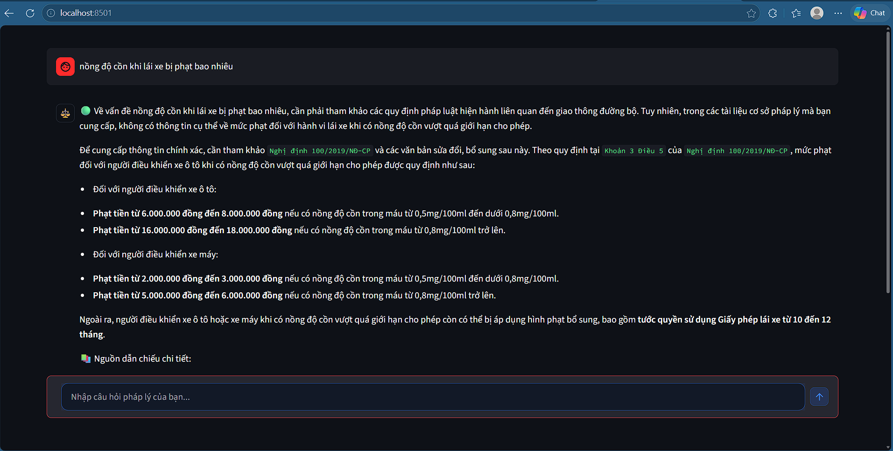
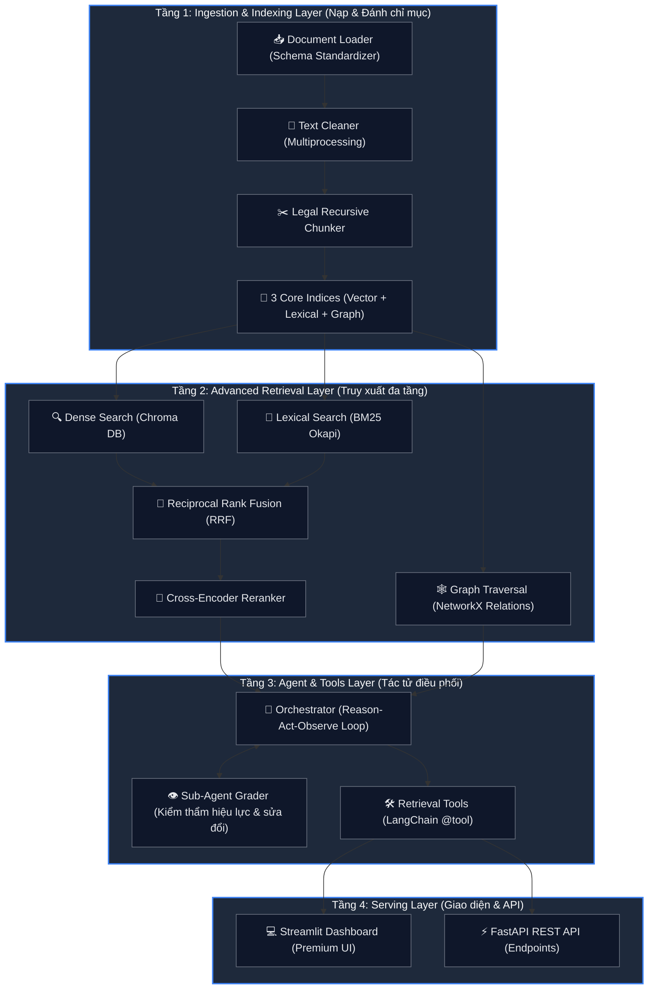

# ⚖️ Trợ Lý Pháp Luật Việt Nam - 4-Layer Agentic RAG System

Hệ thống **Agentic RAG** (Retrieval-Augmented Generation) 4 tầng chuyên sâu cho luật pháp Việt Nam. Hệ thống giải quyết triệt để hai điểm yếu chí tử của RAG truyền thống trong ngành luật: **sự ảo giác (hallucination)** và **sự lỗi thời của văn bản pháp lý (văn bản hết hiệu lực hoặc bị sửa đổi, bổ sung)**.

Hệ thống được phát triển bằng **LangChain**, **ChromaDB**, **BM25**, **NetworkX** (đồ thị quan hệ), **FastAPI** và giao diện premium **Streamlit**.

---

## 🖼️ Demo



> *Ví dụ: Tra cứu mức phạt nồng độ cồn khi lái xe — hệ thống trích dẫn chính xác điều khoản theo Nghị định 100/2019/NĐ-CP kèm trạng thái hiệu lực.*

---

## 🗺️ Sơ đồ Kiến trúc & Luồng dữ liệu (Architecture & Data Flow)

Hệ thống tuân thủ nghiêm ngặt mô hình kiến trúc **4 lớp lớp chồng lớp (Layered Architecture)** từ dưới lên trên:



---

## ⚙️ Vòng lặp Agentic Loop (Reason - Act - Observe)

Hệ thống triển khai cơ chế tác tử suy luận tự sửa sai để xử lý tình trạng văn bản pháp luật bị thay đổi hiệu lực:

1. **Reason (Suy luận)**: Khi người dùng đặt câu hỏi, tác tử (LLM) phân tích câu hỏi để lựa chọn chiến lược tìm kiếm ban đầu (ví dụ: dùng BM25 khi hỏi số hiệu luật, dùng Hybrid khi hỏi quy định chung).
2. **Act (Hành động)**: Tác tử kích hoạt các công cụ tìm kiếm (`retrieval_tools`) để trích xuất các điều khoản pháp luật.
3. **Observe (Giám sát & Chấm điểm)**: Một **Sub-Agent Grader** chấm điểm độc lập các tài liệu thu thập được:
   - Nếu phát hiện điều khoản trích dẫn thuộc văn bản đang ở trạng thái **Bị sửa đổi** (`amended`) hoặc **Hết hiệu lực** (`expired`), Grader lập tức báo động và yêu cầu **Tự sửa sai (Self-Correction)**.
   - Kích hoạt **Graph Traversal Tool** để đi theo các cạnh đồ thị (NetworkX) tìm các văn bản sửa đổi/thay thế liên quan (ví dụ: truy xuất ra Nghị định 14/2022/NĐ-CP sửa đổi cho Nghị định 15/2020/NĐ-CP).
4. **Synthesize (Tổng hợp)**: Reranker chuẩn hóa độ liên quan, LLM biên soạn câu trả lời chặt chẽ, gắn kèm biểu tượng hiệu lực (`🟢`, `🟡`, `🔴`) và danh sách dẫn chiếu nguồn chính xác.

---


## 🚀 Hướng dẫn cài đặt và vận hành (Quick Start)

### 1. Cài đặt các thư viện phụ thuộc
Hệ thống sử dụng các thư viện Python hiện đại (bao gồm langchain-groq mới):
```bash
pip install chromadb rank-bm25 networkx sentence-transformers fastapi uvicorn streamlit python-dotenv langchain-google-genai langchain-groq langchain-community pyyaml pandas
```

### 2. Thiết lập khóa API
Tạo file `.env` ở thư mục gốc của dự án để cấu hình linh hoạt đa LLM Provider (Gemini & Groq):
```env
# Lựa chọn LLM Provider chính cho Chatbot & Agent: 'gemini' hoặc 'groq'
LLM_PROVIDER=groq

# Google Gemini API Keys (bắt buộc để sinh Vector Embeddings)
GEMINI_API_KEY=your_actual_gemini_api_key_here

# Groq API Keys (bắt buộc nếu LLM_PROVIDER=groq)
GROQ_API_KEY=your_actual_groq_api_key_here
GROQ_MODEL=llama-3.3-70b-versatile
```


### 3. Khởi chạy luồng nạp và đánh chỉ mục (Ingestion)
Hệ thống tích hợp và tự động tải dữ liệu pháp luật Việt Nam thực tế từ dataset **`th1nhng0/vietnamese-legal-documents`** trên Hugging Face thông qua REST API (bao gồm đầy đủ số ký hiệu, nội dung điều khoản, tình trạng hiệu lực và sơ đồ đồ thị liên kết chéo giữa các Luật và Nghị định sửa đổi bổ sung):

```bash
python scripts/ingest.py --sample 1000
```
*Kết quả:* Tạo cơ sở dữ liệu ChromaDB, file chỉ mục BM25 (`data/bm25/`) và đồ thị NetworkX (`data/graph/`) thành công trên ổ đĩa.


### 5. Khởi chạy REST API Server
```bash
uvicorn src.api.main:app --host 127.0.0.1 --port 8000 --reload
```
- Khảo sát tài liệu Swagger API tại: `http://127.0.0.1:8000/docs`
- Endpoint truy vấn: `POST http://127.0.0.1:8000/query` (body: `{"query": "...", "strategy": "agentic"}`)

### 6. Khởi chạy giao diện Chatbot Premium (UI)
```bash
streamlit run src/ui/app.py
```

---

## 🛡️ Cấu trúc thư mục mã nguồn
```text
Agentic - chatbot/
├── configs/
│   ├── config.yaml          # Quản lý cấu hình tập trung (overlap, k, hops, RRF)
│   └── setting.py           # Đọc YAML cấu hình động
├── data/                    # Nơi lưu trữ 3 CSDL (Chroma, BM25, Graph)
├── scripts/
│   └── ingest.py            # Chạy nạp dữ liệu tại thư mục gốc
├── src/
│   ├── agents/
│   │   ├── rag_agent.py     # Prompt tác tử, Grading, Phân loại câu hỏi
│   │   └── orchestrator.py  # Điều khiển vòng lặp Agentic Loop (Reason-Act-Observe)
│   ├── api/
│   │   ├── main.py          # FastAPI Server (POST /query)
│   ├── indexing/
│   │   ├── bm25_index.py    # Chỉ mục từ khóa BM25 Okapi & Tokenizer Tiếng Việt
│   │   ├── chroma_store.py  # Quản lý kho vector ChromaDB
│   │   ├── embeddings.py    # Factory nhúng Gemini / HuggingFace offline
│   │   └── graph_index.py   # Xây dựng và duyệt đồ thị NetworkX DiGraph
│   ├── ingestion/
│   │   ├── loader.py        # Schema chuẩn hóa và CSDL Việt Nam hạt giống
│   │   ├── cleaner.py       # Làm sạch văn bản song song (Windows crash fallback)
│   │   └── chunker.py       # Tách đoạn theo cấu trúc luật Tiếng Việt
│   ├── retrieval/
│   │   ├── dense.py         # Tìm kiếm ngữ nghĩa
│   │   ├── bm25.py          # Tìm kiếm từ khóa
│   │   ├── hybrid.py        # Trộn kết quả RRF
│   │   ├── reranker.py      # Xếp hạng lại bằng Cross-Encoder/LLM fallback
│   │   └── graph.py         # Duyệt đa bước tìm luật sửa đổi/bổ sung
│   ├── llm.py               # Kết nối & Động hóa LLM (Gemini / Groq) với Singleton Cache
│   └── ui/
│       └── app.py           # Streamlit Premium Interface
└── README.md                # Tài liệu hướng dẫn hệ thống
```
